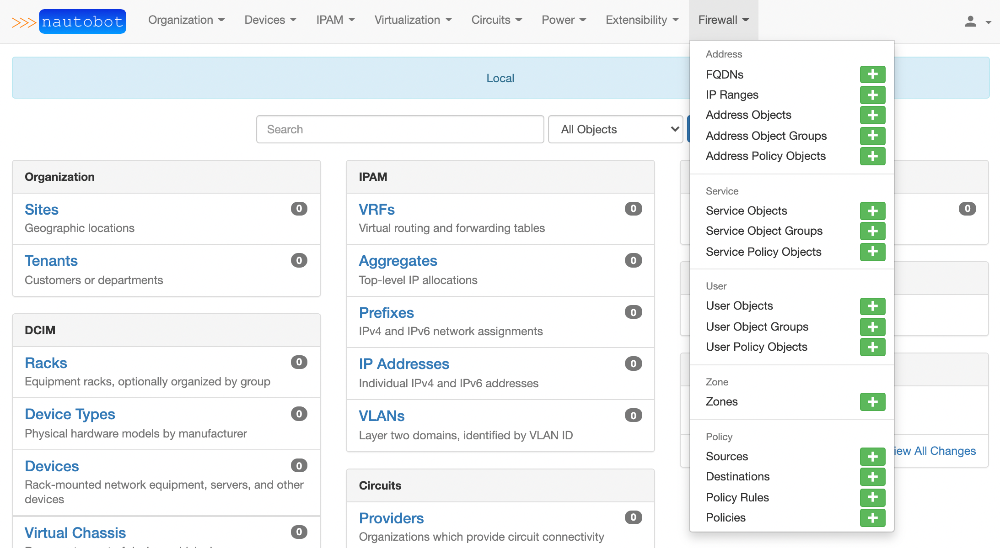
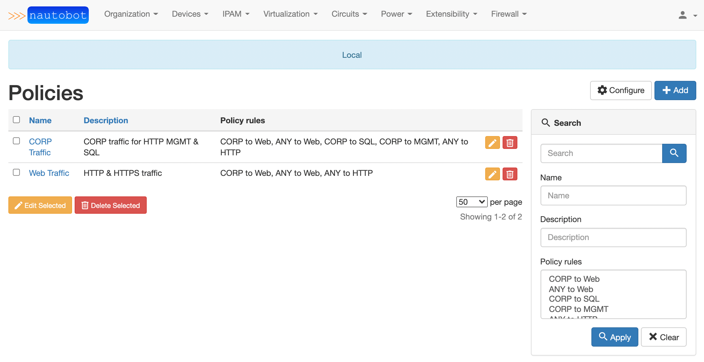
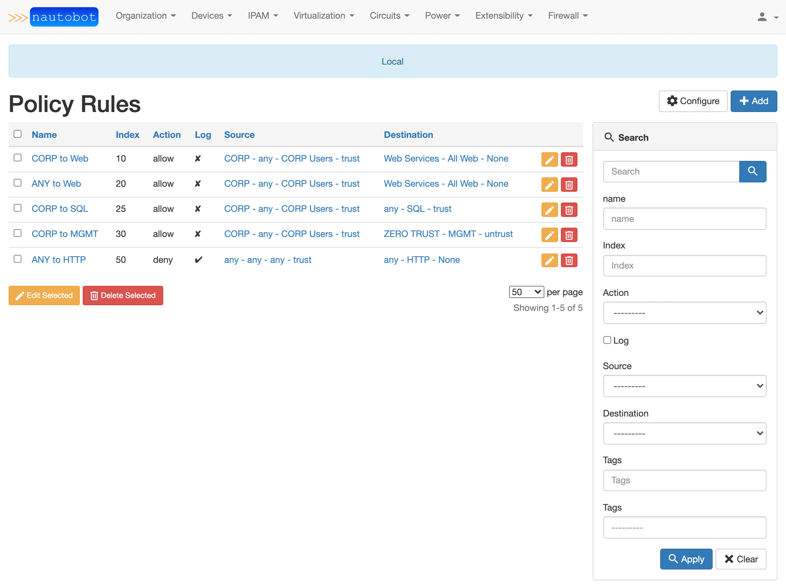
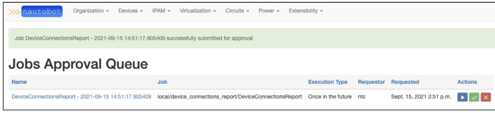
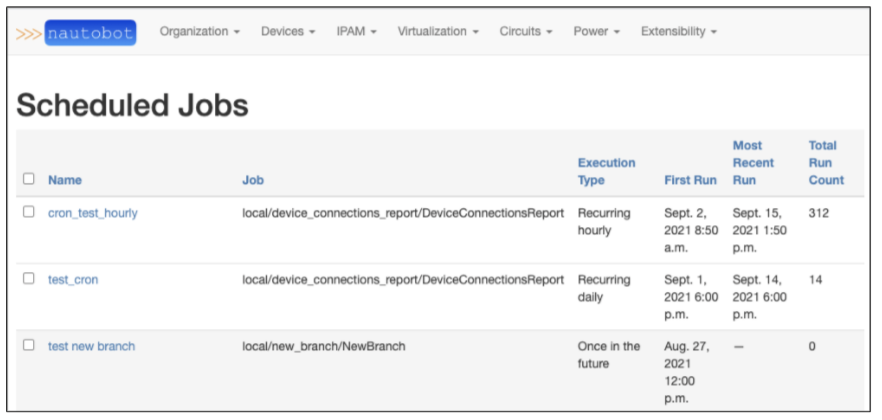

# Nautobot Community Meeting - 2012-09-30

Agenda: https://github.com/nautobot/community/issues/1

`jathanism`: Okay! Welcome to the first Nautobot Community Meeting!

`jathanism`: Today's Agenda:

- Announcements & Reminders
- Overview of Issue Intake Process & Community Contributions
- Stale Pull Requests Review
- Q&A about Upcoming Features
- New Ideas/Proposals that need traction/attention (that already have an Issue or Discussion Open)
- Open Discussion & Forum

`jathanism`: First up: Announcements & Reminders

`jathanism`: Reminder: We want your bug reports and even issues with the documentation are bugs! If you can't use Nautobot, what's the point!

`jathanism`: We also want to remind you that we want your contributions! We're still working on lowering the barrier to entry to contribution. Your feedback is welcome.
> `Tim Fiola`:
> Yes, please do not be shy.  Opening up doc bugs helps us understand our blind spots and fix them

## Issue intake Process & Community Contributions

`jathanism`: Next up: **Overview of Issue Intake Process & Community Contributions**

`jathanism`: We have documented our workflow intake process and it has been evolving rapidly. Docs and diagrams can be found on the wiki here: https://github.com/nautobot/nautobot/wiki/Work-Intake-&-Issue-Management

> `jedelman8`:
> While it is documented in the workflow diagram, one point is that if something is labeled as "workflow: near term" it means, the core team's plan is to do it in the next release or two...BUT, if anyone desires to pick it up before that, just comment in the issue, and it's yours! `:slightly_smiling_face:` Same goes for "future" items that are 3+ releases out...

`jathanism`: Our new feature request template asks that you use the personas documented here: https://github.com/nautobot/nautobot/wiki/Personas

`jathanism`: We use the personas to map important roles to use-cases, and it's very helpful to us in understanding how issues impact various users.

## Stale Pull Requests Review

`jathanism`: Next up: **Stale Pull Requests Review**

`jathanism`: For this section we want to check on updates that are waiting for action from the community and not on the end of the Nautobot core team.

`jathanism`: Here is an example: <strike>https://github.com/nautobot/nautobot/pull/811 (Bad example)</strike> (edited) 

`jathanism`: Anyhow, at this time, there aren't any waiting on the community! So next topic!

## Q&A about Upcoming Features
`jathanism`: Next up: **Q&A about Upcoming Features**

`jathanism`: We have a few items provided by `@Eric Jacob` that we'll start with. Thanks for the questions, Eric!

### Feature -- Updated UI

`jathanism`: - The future of the UI (have you considered client-side javascript frameworks like Vue or React?)

> `jathanism`:
> We have considered this, however, it's likely not going to be anytime soon. We need to decide which API we want to align around: REST or GraphQL, and then invest in making that interface more robust to not require any direct database access for external clients (like a front-end client).
>
> `Stephen Kiely`:
> I have started a community based VueJS UI, but it is still very much in the infancy stage. This is very much not official, and something that I am working on in my spare time. https://github.com/smk4664/nautobot_frontend
>
> `jathanism`:
> Whoa `Stephen Kiely`!

 _Note the below was moved from the main channel to the relavant thread_

`Eric Jacob`: Ok then, so any plan to update the UI with Bootstrap 5 like Netbox did?

> `jathanism`: Yes, we've discussed that, too, and that will be easier to do but not quite on the roadmap yet.
> 
> `jathanism`: Also please try to reply to the threads so we can keep the topics organized! `:slightly_smiling_face:`

### Feature -- DCIM | Floor Plan

`jathanism`: - DCIM missing features like floor plan

> `Glenn M`:
> Floor plan mapping, a la https://github.com/nautobot/nautobot/issues/847 is a feature that we’re not currently prioritizing in the core team, but we think could make a very interesting plugin candidate if someone wants to work through the design and implementation.
>
> `Eric Jacob`:
> Well, floor plan is a killing feature for us.
>
> `Eric Jacob`:
> And this feature has been requested in the past...
>
> `Eric Jacob`:
> Barcode scanner too would be very useful... 
>
> `jathanism`:
> Ahh, these are good topics for a discussion to start formulating ideas around the use-cases and how we would model it. If you would please: https://github.com/nautobot/nautobot/discussions
>
> `jathanism`:
> Did you mean a barcode generator? Like QR codes?
>
> `Eric Jacob`:
> No, more like a barcode reader to populate the database.
>
> `jathanism`:
> Oh, hmm sounds interesting but also possibly complicated!
>
> `Eric Jacob`:
> Maybe it's to advanced/complicated as feature, forget about it!
>
> `Nick Niehoff`:
> the barcode readers I have seen are essentially usb HIDs (keyboards) are you looking for more than that?
>
> `jathanism`:
> ***hint*** great discussion topic
>
> `jedelman8`:
> Are you talking about the reverse of this?  https://github.com/k01ek/netbox-qrcode  -- that generates QR codes for objects in the database, but you're looking to populate the database from barcodes?  Like receive device off loading dock, scan it, then it magically enters Nautobot? `:slightly_smiling_face:`
>
> `Eric Jacob`:
> Yes, that's it! Sorry, my english is not very good...
>
> `jedelman8`:
> That's it, as in that exact thing, but for Nautobot?
>
> `jedelman8`:
> or in the latter half of what I described? `:slightly_smiling_face:`
>
> `Eric Jacob`:
> The latter half
>
> `Eric Jacob`:
> Not sure if it feasible...
>
> `Eric Jacob`:
> But Sunbird supports that feature...
>
> `jedelman8`:
> it may be application specific...out of curiousity, what vendor/brand of a barcode reader do you use?
>
> `jedelman8`:
> Is sunbird the manufacturer?
>
> `Eric Jacob`:
> No idea. I'll have to check.
>
> `jathanism`:
> https://www.sunbirddcim.com ?
>
> `Eric Jacob`:
> Sunbird is a DCIM software.
>
> `jedelman8`:
> Roger that!
>
> `jedelman8`:
> We'll definitely check it out.

### Feature -- Ansible & Terraform Job Runners

`jathanism`: - Ansible and Terraform runners for jobs

> `jathanism`:
> We have talked about them, but nothing concrete. Nothing on the roadmap at this time. This might be a good discussion topic for https://github.com/nautobot/nautobot/discussions
>
> `brobare`:
> This is one that i'd +1. Specifically the Ansible runner.
>
> `Eric Jacob`:
> https://ansible-runner.readthedocs.io/en/stable/
>
> `jedelman8`:
> Yes, this has been discussed before, but it is correct, not on roadmap yet, as it was just an idea re: Ansible runner.  Initial plans were to do something similar the Nornir plugin developed such that other plugins and jobs can be built on top.   We would definitely would love feedback in a discussion!
>
> `jathanism`:
> I'd also like to add that we definitely want to understand the use-cases. We're not looking to replace Ansible Tower/AWX!
>
> `jedelman8`:
> Yes, exactly what `@jathanism` said.  Initial thoughts I was referring to was Tower/AWX runner.  Curious if there is thoughts to have a local runner too/though?
>
> `brobare`:
> for it to be useful to me and $dayjob, we'd need it to be a local runner. we dont awx/tower.
>
> `Eric Jacob`:
> One use-case in mind: We want to use the Arista AVD collection to configure Arista devices. An Ansible local runner would be useful.

### Feature -- Secrets

`jathanism`: - Secrets ([Initial model, UI, and REST API for Secrets nautobot#868](https://github.com/nautobot/nautobot/pull/868))

> `Glenn M`:
> This is an important feature to us and is very actively in development at this time. Keep an eye on this space!

## Feature -- Firewall Model

`jathanism`: - Firewall objects ([Firewall Object Model - Possibly Plugin nautobot#904](https://github.com/nautobot/nautobot/discussions/904))

> `jathanism`:
> Based on the discussion there is an early prototype of a firewall modeling plugin, but it's not quite ready to show  yet. Here is a small preview though: https://github.com/nautobot/nautobot/discussions/904#discussioncomment-1359953
>
> `Eric Jacob`:
> Very interested in this!
>
> `jathanism`:
> Okay here's some more previews `:slightly_smiling_face:`
>
> `Tim Fiola`:
> `@whitej6` `:point_up_2:`
>
> `jathanism`:
> 
>
> `jathanism`:
> 
>
> `jathanism`:
> 
>
> `whitej6`:
> I can jump on the call in a bit to chat about it `:slightly_smiling_face:`
>
> `jathanism`:
> It's all on Slack. I knew your ears would be ringing.
>
> `whitej6`:
> {meme omitted}

## Feature -- Scheduling & Approvals for Jobs 

`jathanism`: - Scheduling & Approvals for jobs ([Scheduling & Approvals for jobs nautobot#805](https://github.com/nautobot/nautobot/pull/805))

> `jathanism`:
> This is implemented currently in the `next` branch (for the brave), and will be officially be released in v1.2.0!
>
> `Tim Fiola`:
> 
>
> `Tim Fiola`:
> 
>
> `Tim Fiola`:
> from the `next` branch `:point_up_2:`
>
> `Eric Jacob`:
> Have you encountered any issues with celery-beat?
>
> `Eric Jacob`:
> I guess that's what you're using...
>
> `jathanism`:
> Not yet. So far we're only leveraging the crontab-based scheduling. Did you have any specific concerns?
>
> `Eric Jacob`:
> Well, we use it at work, and sometime, it doesn't execute anything and it is very hard to troubleshoot...
>
> `jathanism`:
> Hmm, we're using the database scheduler that comes with the `django-celery-beat` extension and it has been pretty deterministic thus far.
>
> `jathanism`:
> Check out the docs and perhaps kick the tires on the `next` branch? https://nautobot.readthedocs.io/en/next/additional-features/job-scheduling-and-approvals/
>
> `Eric Jacob`:
> Will do!
>
> `jathanism`:
> So that also means that the scheduled jobs also persist in the database and I'd like to think that also helps with troubleshooting.

## Open Floor

`jathanism`: Thanks for all the great replies on the Q&A! We're going to move to the next topic.

`jathanism`: Next up: **New Ideas/Proposals that need traction/attention** (that already have an Issue or Discussion Open)

`jathanism`: Here are the open Ideas on GitHub: https://github.com/nautobot/nautobot/discussions/categories/ideas

`jathanism`: We already discussed the firewall object model so we can skip that one.

### Token 

`Stephen Kiely`:
https://github.com/nautobot/nautobot/discussions/471 Token Creation from API

> `Glenn M`:
> I think we agree it is a good idea, but haven’t prioritized it yet. We just need to decide on an implementation and do it. :-)

_Note: This was moved to be inline with the parent topic_

`brobare`:
idea on when/if https://github.com/nautobot/nautobot/issues/901 is going to get worked/prioritized?

> `jathanism`:
> Great question! We did a preliminary review the other day and decided that we don't have a clear path forward.
>
> `jathanism`:
> There's already permissions for tokens, but if a user has the `is_superuser=True` flag set, permissions aren't even checked. This is how it goes with Django permissions. We'd have to explicitly consider how to override this. It's not as easy as it sounds.
>
> `jathanism`:
> The other alternative is completely replacing this token model with something more secure like JWT, OAuth, etc which are also ... non-trivial.
>
> `Eric Jacob`:
> +1 for JWT `:slightly_smiling_face:`
>
> `Stephen Kiely`:
> I like the JWT idea.
>
> `brobare`:
> i didnt look at it that closely, but, you’re saying that only superusers could see other peoples tokens? Austin the Network engineer cant see PD the Plugin Developers api tokens?
>
> `brobare`:
> as long as Austin isnt a SU?

### Technical Guidance

`Eric Jacob`:
Have you any plan to release some "recipes" on how to onboard some devices based on your experiences? For example, we have a hard time figuring out how to model F5 BIG-IP systems in Nautobot with their virtual servers...

> `jathanism`:
> Well in that specific case for F5 BIG-IP, we have also been mulling the idea of a "load balancer" modeling plugin.
> 
> `jathanism`:
> Nothing concrete there yet but we have talked about it.
>
> `Eric Jacob`:
> OK, should I open a discussion on github?
>
> `jathanism`:
> As for "recipes", Nautobot's data model for device types, device roles, etc, are all still compatible with those from NetBox. For example: https://github.com/netbox-community/devicetype-library
>
> `jathanism`:
> There is also the Nautobot Welcome Wizard plugin that tries to make this easier: https://github.com/nautobot/nautobot-plugin-welcome-wizard
>
> `jathanism`:
> But yes, if there's anything else you're thinking, please open a discussion.
>
> `Nick Niehoff`:
> I would suggest the onboarding plugin but I'm not sure it supports F5 either
>
> `jathanism`:
> Thank you `@Nick Niehoff`. It's here: https://github.com/nautobot/nautobot-plugin-device-onboarding
>
> `Eric Jacob`:
> Thx all, but my question is more about how to map F5 BIG-IP for example, with their VS vlans/subnets, SNAT vlans/subnets, virtual servers and where to keep those configs...
>
> `jathanism`:
> Yeah that would definitely be something we would try to solve with a future plugin just for that.
>
> `jathanism`:
> I think we should go ahead and start a discussion on modeling LB/ALB.
>
> `Eric Jacob`:
> I know the discussions are closed, but another example is the SSoT Arista CloudVision plugin to synchronize CVP with Nautobot. We would like to launch a job to configure Arista switches based on newly added devices by the plugin. What's your experiences with Arista, ZTP and Nautobot? 

## Open Floor

`Glenn M`:
Let’s move on to **Open Discussion & Forum** then `:slightly_smiling_face:`

`jathanism`:
So for open discussion, please think of this like a Reddit AMA. Ask us anything! `:slightly_smiling_face:`

### Database Support

`Eric Jacob`:
Which databases do you plan to add support in the near future?

> `jathanism`:
> DoltHub support (which is MySQL-compatible) is coming soon w/ the version control plugin. https://github.com/nautobot/nautobot-plugin-version-control
>
> `jathanism`:
> No other backends are planned at this time, although there has been a request for MSSQL but we still need to refine the requirements: https://github.com/nautobot/nautobot/issues/796
>
> `Tim Fiola`:
> `@Eric Jacob` Here is a link to our GitHub community repo https://github.com/nautobot/community/tree/main/content
>
> `Eric Jacob`:
> Dolt seems promising!
>
> `Tim Fiola`:
> There are a couple recent blog posts on our Dolt database integration
>
> `Tim Fiola`:
> hang on I'll get them
> 
> `Tim Fiola`:
> https://blog.networktocode.com/post/nautobots-rollback/
>
>  `Tim Fiola`:
> oh, the second post I'm thinking of is pending, so stay tuned!
>
> `Tim Fiola`:
> I just wrote it last week
>
> `Tim Fiola`:
> and I also just made a video . . .
>
> `Tim Fiola`:
> LOTS of Dolt (Version Control) content in the pipe!
>
> `mcgoo298`:
> Dolthub has also released a blog: https://www.dolthub.com/blog/2021-09-24-announcing-nautobot-on-dolt/

## Closing Remarks

`jathanism`:
And with that, we're out of time! Thank you everyone for participating in the first Nautobot Community Meeting! We'll post the notes and logs soon and follow-up here.

`jathanism`:
You'll be able to find the meeting notes here: https://github.com/nautobot/community
