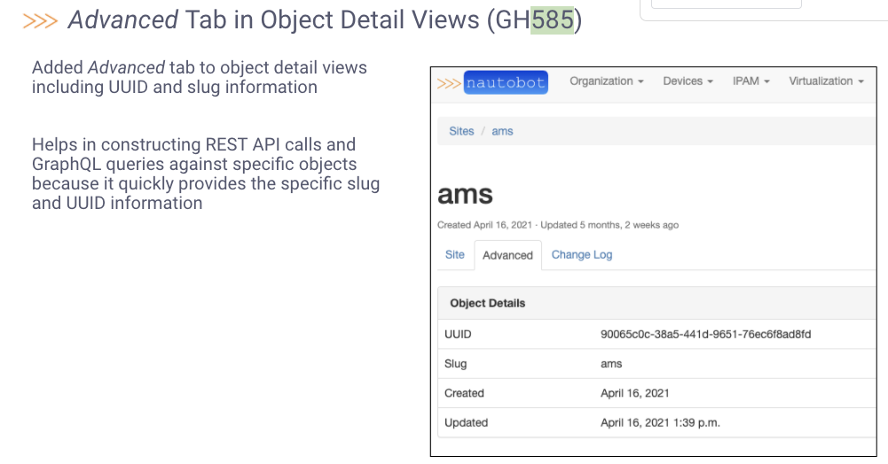
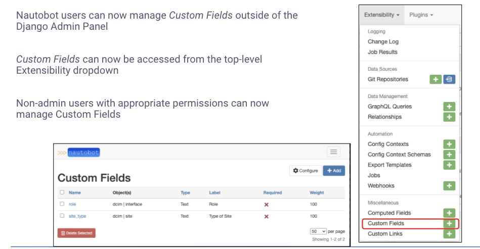
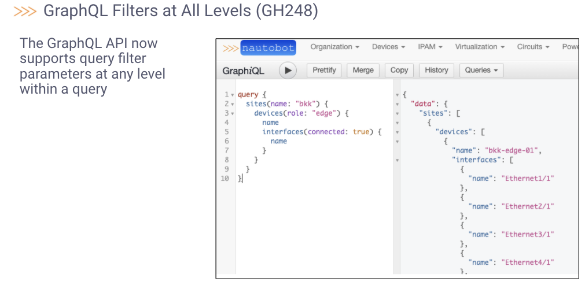
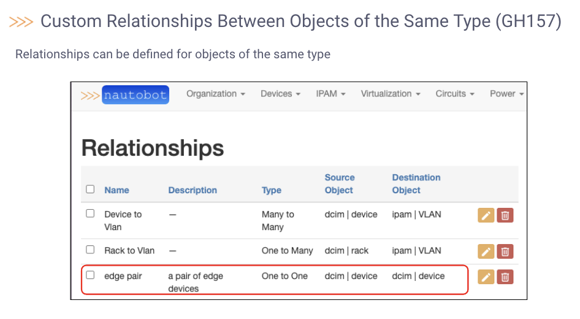

# Nautobot Community Meeting - 2021-10-28

Agenda: https://github.com/nautobot/community/issues/9

##  **Announcements & Reminders!**

`jathanism`: We are targeting v1.2.0 by end of November/early December

`jathanism`: v1.2.0beta.1 will be out within the next week

> `Glenn M`: https://nautobot.readthedocs.io/en/next/release-notes/version-1.2/#release-overview
>
> `jathanism`: Thanks. We'll come back to that one in a few!
>
> `jedelman8`: Just to leave some room, let's say the next two weeks :slightly_smiling_face: . Just in case....

##  **Stale Pull Requests Review**

`jathanism`: Here are the stale pull requests we want to review:

- \#999 **[Update ubuntu.md](https://github.com/nautobot/nautobot/pull/999)**
- \#1002 **[Add URM as Fiber Optic Port Type](https://github.com/nautobot/nautobot/pull/1002)**
- \#1006 **[Abort transaction when a job failed](https://github.com/nautobot/nautobot/pull/1006)**

> `jathanism`: For #999: There needs to be a decision on whether to stick with `CREATE USER` for PostgreSQL database setup. We are inclined to leave it.
>
> `jathanism`: For #1002 (Add URM as Fiber Optic Port Type): We are awaiting a response on the new interface types (also the tests are failing).
>
> `jathanism`: For #1006 (Abort transaction when a job failed): Seems salient, however we just haven't gotten to it yet!
>
> `Glenn M`: Specifically relating to #1006, there’s some relevant discussion on the parent issue (#1005). We want to make sure we’re not breaking current job expectations around pass/fail/abort behavior as a side effect
>
> `jathanism`: For reference: [Database changes for a failed job are not automatically rolled back #1005](https://github.com/nautobot/nautobot/issues/1005)

## **Q&A about Upcoming Features**

`jathanism`: Please see: https://nautobot.readthedocs.io/en/next/release-notes/version-1.2/#release-overview

`jathanism`: We'll leave some time for open Q&A here

### Common Base Template for Object Detail Views ([#479](https://github.com/nautobot/nautobot/issues/479), [#585](https://github.com/nautobot/nautobot/issues/585))

>`Tim Fiola`: 

### Custom Fields are now User Configurable ([#229](https://github.com/nautobot/nautobot/issues/229))

> `Tim Fiola`: 

### Custom Field Webhooks ([#519](https://github.com/nautobot/nautobot/issues/519))

### Database Ready Signal ([#13](https://github.com/nautobot/nautobot/issues/13))

### GraphQL Filters at All Levels ([#248](https://github.com/nautobot/nautobot/issues/248))

> `Tim Fiola`: 

### Installed Plugins List and Detail Views, Plugin Config and Home Views ([#935](https://github.com/nautobot/nautobot/pull/935))

### Same-Type and Symmetric Relationships ([#157](https://github.com/nautobot/nautobot/issues/157))

> `Tim Fiola`: 
>
> `brobare`: excited for this one. being able to do device to device and circuit to circuit dependencies will be pretty awesome.
>
> `jathanism`: Your feedback on the docs for this would be great!
>
> `jathanism`: https://nautobot.readthedocs.io/en/next/models/extras/relationship/#relationship-types

## New Ideas/Proposals that need traction/attention (that already have an Issue or Discussion Open)

`jathanism`: I'll link some discussions that are of particular interest to the core team. However, please bring up any others. We'll leave some time for participation!

`jathanism`: **[Ability to reserve a device](https://github.com/nautobot/nautobot/discussions/1033)**

`jathanism`: **[Load-balancer modeling plugin](https://github.com/nautobot/nautobot/discussions/995)**

`jathanism`: **[Unify Device and VirtualMachine in a single table. Differentiate between the 2 using `is_virtual` flag.](https://github.com/nautobot/nautobot/discussions/1015)**

## Open Discussion & Forum

`damien`: This issue came up few times recently on different projects, would it be possible to have it included in 1.2 ? https://github.com/nautobot/nautobot/issues/1004

> `jathanism`: We already slotted it for v1.3.0. Nothing is impossible! But it would likely have to replace something already on the milestone remaining for v1.2.0.
>
> `jathanism`: If the community had to pick, it would be good to hear feedback on what people might want to see swapped from the milestone here: https://github.com/nautobot/nautobot/milestone/3
>
> `jedelman8`: Remaining items are GH-370, GH-446, GH-685, GH-722. Which of those would people be okay dropping in favor of GH-1004?
>
> `jathanism`: Links incoming
>
> `jathanism`: [Add ability to store configuration settings in the database](https://github.com/nautobot/nautobot/issues/370)
>
> `jathanism`: [Restart required to view new Relationship in GraphQL](https://github.com/nautobot/nautobot/issues/446)
>
> `jathanism`: [Add ](https://github.com/nautobot/nautobot/issues/685)`include`[ parameter to the Open API interface](https://github.com/nautobot/nautobot/issues/685)
>
> `jathanism`: [Add GraphQL unit tests for computed fields](https://github.com/nautobot/nautobot/issues/722)
>
> `damien`: I would be good if we swap 1004 for 446 or 722
>
> `jvanderaa`: I’d even be OK if 370 slipped in favor for 1004
>
> `jedelman8`: We'll let this sit for a bit before making any decisions, but keep the thoughts coming!

## Q&A and FYI about Developer Experience

`jathanism`: For this topic we'd like to hear from you about any lingering development questions or concerns.

### Secrets Integration

`jathanism`: We'd also like to make you aware of the progress on the Secrets integration we'll be included in the first beta release: [Secrets integration](https://github.com/nautobot/nautobot/pull/868)

`jathanism`: Along with this release will be a plugin that publishes Secrets Providers. The first two providers are **Hashicorp Vault** and **AWS Secrets Manager**.

`jathanism`: We also wanted to reiterate the [new dashboard for installed plugins](https://github.com/nautobot/nautobot/pull/935)

### BGP Models Plugin

`brobare`: idea on timeline for the BGP models and/or plugin? remember seeing a BGP tab on the [demo.nautbot.com](http://demo.nautbot.com/) site (thats been removed now i understand because of an issue). 

i am looking to replace phpIPAM with nautobot and BGP is a feature not currently available. just trying to understand timeline when/if someone else is doing one to sus out if i need to write a plugin to get me going.

> `jathanism`: It's still in the works, but needs a fair bit of work to cleanup, so we haven't open-sourced it just yet.
>
> `jathanism`: There are a number of core issues around the data model we aren't happy with. Kind of clunky.
>
> `jathanism`: Particularly the data model is too opinionated and not abstract enough.
>
> `brobare`: gotcha. so "yes" to the "someone else is doing it" question. about timelines...think this will be a 1.3 feature? any later than that and I think i'll probably want to throw something together of my own to be able to facilitate getting off phpipam.also, while my python skills are somewhat weak, i'd also be willing to help out in doing some of the cleanup. might be easier than rolling my own thing.
>
> `jathanism`: Well this won't be a core feature set, but yeah sometime in the 1.3.0 epoch.
>
> `jathanism`: Sounds like somebody wants to beta test? :sunglasses:
>
> `brobare`: absolutely can help out with that

## Closing Remarks

`jathanism`: And that concludes our 2nd Nautobot Community Meeting. Thanks for the participation! We'll follow up with the meeting notes once we publish them.
